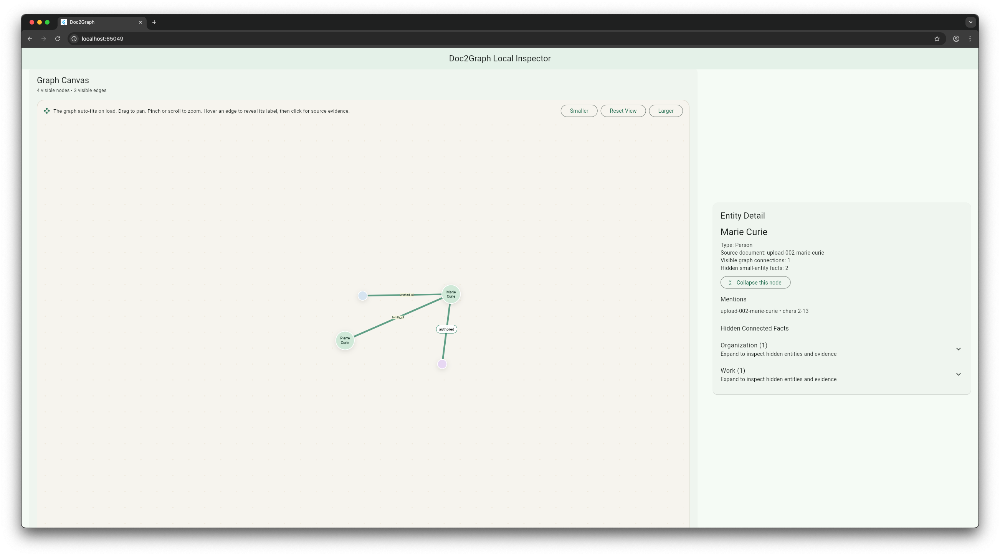
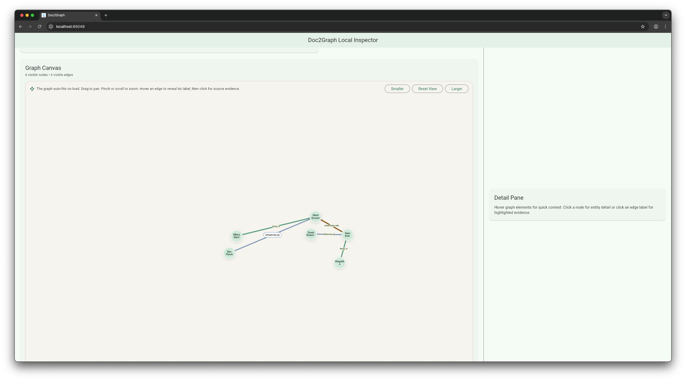

# Doc2Graph: Intelligent Knowledge Graph Extraction from Documents

Doc2Graph transforms biographical documents into interactive knowledge graphs with full source provenance. Extract entities, relationships, and their connections from Wikipedia articles or any biographical text, with built-in entity fusion and cross-document relation detection.


## Key Features

### 1. Interactive Knowledge Graph Visualization

Extract and visualize entities (Person, Organization, Place, Work, Time) and their relationships from biographical documents. The interactive graph canvas supports:

- **Pan and Zoom**: Navigate large graphs with smooth pan/zoom controls
- **Connected Node Dragging**: Drag nodes and their connected neighbors move together, maintaining spatial relationships
- **Source Provenance**: Click any entity or relation to view the exact source text with highlighting
- **Evidence Highlighting**: See the original document text that supports each extracted fact
- **Confidence Filtering**: Filter relations by confidence threshold and relation type
- **Force-Directed Layout**: Automatic graph layout with entity-type-specific positioning

### 2. Entity Fusion and Disambiguation



Automatically merge duplicate entities across documents that refer to the same real-world entity:

- **Cross-Document Fusion**: Identifies entities like "Marie Curie" and "Maria Skłodowska" as the same person
- **Alias Accumulation**: Preserves all name variations (maiden names, married names, transliterations)
- **Smart Matching**: Uses birth/death dates, spouse information, affiliations, and shared facts to identify duplicates
- **LLM-Powered Validation**: Claude validates and merges entities with high confidence

**Example Test Cases:**
- `fusion_test_file/marie_curie.md` + `fusion_test_file/maria_sklodowska.md` → Single "Marie Curie" entity with "Maria Skłodowska" as alias
- `fusion_test_file/muhammad_ali.md` + `fusion_test_file/cassius_clay.md` → Single "Muhammad Ali" entity with name change history

### 3. Inter-File Relation Detection



Extract relationships between entities across different documents:

- **Cross-Document Connections**: Person A in Document A can have relations to Person B whose full biography is in Document B
- **Relation Types**: 13 relation types across 5 categories (PERSON-PERSON, PERSON-ORG, PERSON-PLACE, PERSON-WORK, PERSON-TIME)
- **Evidence Tracking**: Every relation stores character offsets for source text highlighting
- **Normalization**: Relations are deduplicated across documents using (subject, predicate, object) tuples

**Example Test Cases:**
- `inter_file_relation/albert_einstein.md` + `inter_file_relation/niels_bohr.md` → Mutual `collaborated_with` relations between Einstein and Bohr

## Supported Relation Types

**PERSON-PERSON Relations:**
- `influenced_by`, `collaborated_with`, `family_of`, `student_of`

**PERSON-ORG Relations:**
- `worked_at`, `studied_at`, `founded`, `member_of`

**PERSON-PLACE Relations:**
- `born_in`, `died_in`, `lived_in`

**PERSON-WORK Relations:**
- `authored`, `translated`, `edited`

**PERSON-TIME Relations:**
- `born_on`, `died_on`

## Architecture

### Three-Tier Design

**Backend (Go)** - `backend/`
- HTTP API server orchestrating document ingestion and extraction jobs
- Invokes Python extractor via subprocess
- Validates results against JSON Schema and ontology
- Serves graph data to frontend

**Extractor (Python)** - `extractor/`
- Standalone pipeline: reads JSON from stdin, emits JSON to stdout
- Three extraction modes:
  - **regex** (fast, deterministic)
  - **validated** (regex + Claude validation + cross-document fusion) ← **RECOMMENDED**
  - **llm** (pure Claude extraction)
- Cross-document entity fusion and relation deduplication
- Full Unicode support for international names

**Frontend (Flutter)** - `frontend/`
- Interactive graph visualization with force-directed layout
- Entity/relation evidence viewer with source highlighting
- Confidence filtering and relation type filtering
- Connected node dragging for graph manipulation

### Data Flow

1. Frontend uploads documents or triggers Wikipedia fixture endpoint
2. Backend creates Job and stores Documents with character offsets
3. Backend invokes Python extractor subprocess
4. Extractor runs regex extraction → Claude validation → cross-document fusion
5. Backend validates results against schema/ontology
6. Frontend fetches graph data and displays interactive visualization

## Getting Started

### Prerequisites

- Go 1.21+
- Python 3.11+
- Flutter 3.x
- Neo4j (optional, for persistence)

### Installation

```bash
# Install backend dependencies
cd backend && go mod download

# Install extractor dependencies
cd extractor && pip install -r requirements.txt

# Install frontend dependencies
cd frontend && flutter pub get
```

### Running the Application

**Terminal 1: Start Backend**
```bash
cd backend
go run cmd/server/main.go
# Server starts on :8080
```

**Terminal 2: Start Frontend**
```bash
cd frontend
flutter run -d chrome
```

**Terminal 3: Load Wikipedia Fixtures (30 biographical articles)**
```bash
curl -X POST http://localhost:8080/api/v1/dev/fixtures/wikipedia
```

### Running Tests

**Backend Tests:**
```bash
cd backend && go test ./...
```

**Extractor Tests:**
```bash
cd extractor && python3 -m pytest -v
```

**Frontend Tests:**
```bash
cd frontend && flutter test
```

## Test Examples

The project includes comprehensive test fixtures demonstrating key features:

### Entity Fusion Tests (`extractor/fusion_test_file/`)
- `marie_curie.md` + `maria_sklodowska.md` - Same person, different names
- `muhammad_ali.md` + `cassius_clay.md` - Name change scenario

### Inter-File Relation Tests (`extractor/inter_file_relation/`)
- `albert_einstein.md` + `niels_bohr.md` - Mutual collaboration relations

### Wikipedia Fixtures (`backend/testdata/wikipedia_markdown/`)
- 30 biographical articles for integration testing

## Schema Documentation

### Entity Schema
```json
{
  "id": "P:marie_curie",
  "name": "Marie Curie",
  "type": "Person",
  "aliases": ["Maria Skłodowska", "Marie Skłodowska-Curie"],
  "source_doc": "doc_001",
  "mentions": [
    {"doc_id": "doc_001", "char_start": 120, "char_end": 131}
  ]
}
```

### Relation Schema
```json
{
  "id": "R1",
  "subject": "P:marie_curie",
  "predicate": "won_award",
  "object": "W:nobel_prize_physics",
  "evidence": "Marie Curie won the Nobel Prize in Physics in 1903",
  "source_doc": "doc_001",
  "char_start": 450,
  "char_end": 501,
  "confidence": 0.92
}
```

## Configuration

Create `.env` file in `extractor/` directory:

```bash
# Required for LLM validation mode
ANTHROPIC_API_KEY=your_api_key_here

# Extraction mode: "regex", "validated", or "llm"
EXTRACTION_MODE=validated  # Recommended

# Claude model selection
ANTHROPIC_MODEL=claude-3-5-sonnet-20241022
```

## Validation and Quality Assurance

- **Schema Validation**: All extraction results validated against `schemas/export.schema.json`
- **Ontology Validation**: Entity types and relation predicates checked against `schemas/ontology.json`
- **Character Offset Validation**: Ensures all mentions and evidence point to valid text spans
- **Relation Deduplication**: Prevents duplicate relations using (subject, predicate, object) tuples
- **Cross-Document Fusion**: LLM-powered entity disambiguation with confidence scoring

## Future Enhancements

- File upload UI (currently using dev fixture endpoint)
- Neo4j persistence layer (currently in-memory)
- Fuzzy entity matching and alias resolution
- Community detection and graph clustering
- Multi-sentence relationship extraction
- Horizontal scaling support

## License

MIT License - See LICENSE file for details